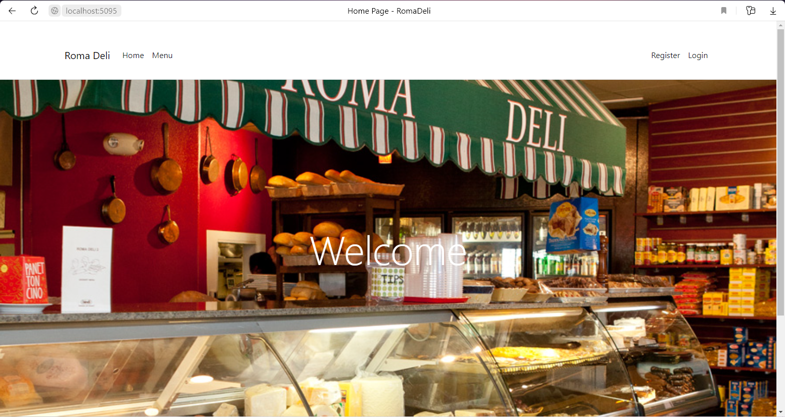

# Roma Deli

# Description

This is a deli website.

When the user opens the page, home page is opened for Roma Deli. It has links to itself, menu, register, and log in pages.

If the user clicks on menu page, menu page is opened with all menu items. It includes picture and description.

If user clicks on log in link, log in page is opened with username and password field where user can log in.

If the user clicks on register page, registration page is opened where user can register with first name, last name, phone number, e-mail, password, and address.

# Creation Process

The web site was written using .NET.
